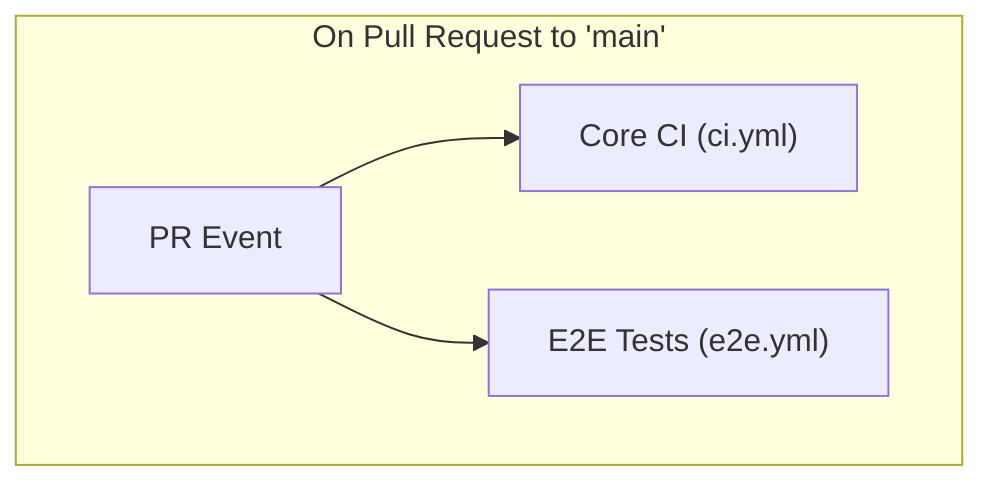
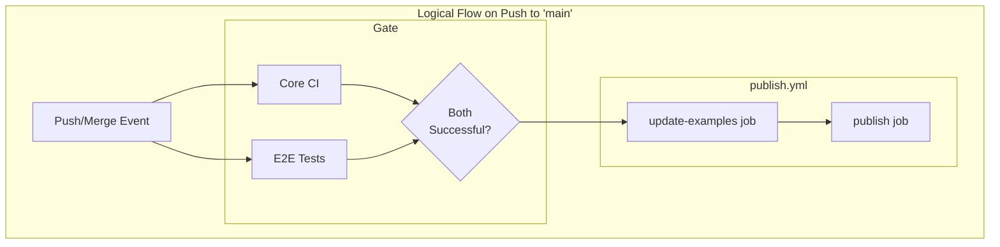

# GitHub Actions Workflow

This diagram illustrates the CI/CD pipeline for this project.

## On Pull Request to `main`

When a pull request is opened targeting the `main` branch, two workflows are triggered in parallel. Both must pass for the PR to be considered safe to merge.

## On Push to `main`

When a commit is pushed to `main` (e.g., after a PR is merged), a sequence is initiated.

1.  `Core CI` and `E2E Tests` run in parallel.
2.  A gate (`reusable-wait-for-core-ci.yml`) ensures both must complete successfully before proceeding.
3.  The `Publish Package` workflow (`publish.yml`) is then triggered.
4.  Inside `publish.yml`, the `update-examples` job runs first, committing any new examples to the repository.
5.  If that succeeds, the `publish` job runs, bumping the version and publishing the package to NPM. This sequential order prevents race conditions.

