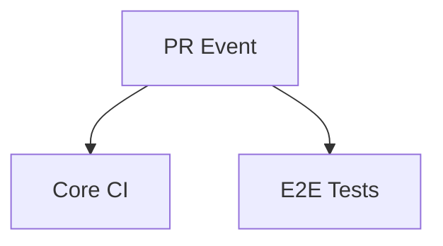
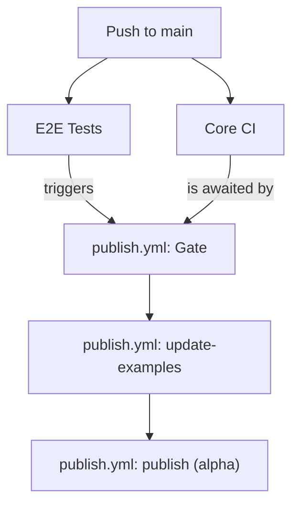
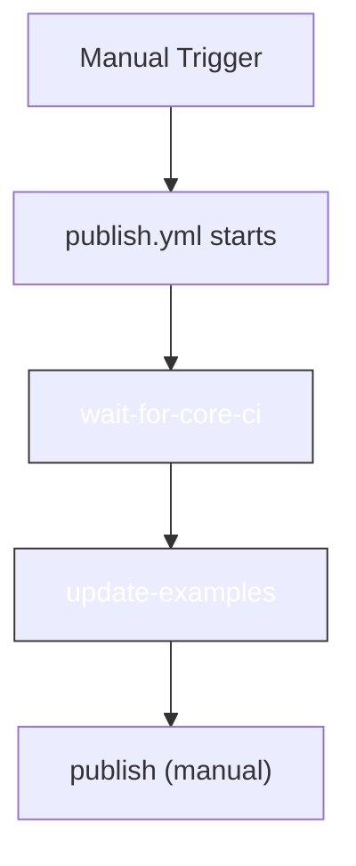

# GitHub Actions Workflow

This document illustrates the three distinct CI/CD pipelines for this project.

---

## 1. On Pull Request

This flow triggers when a pull request is opened targeting the `main` branch. Its purpose is to run checks and tests against the proposed changes. Both jobs must pass for the PR to be considered safe to merge.

---

## 2. On Push to `main` (Automated Alpha Release)

This flow triggers automatically when a pull request is merged into the `main` branch. Its purpose is to update the examples in the repository and publish a new alpha version of the package to NPM.

**Sequence of Events:**

1.  A push to `main` triggers `Core CI` and `E2E Tests` in parallel.
2.  The completion of `E2E Tests` triggers the `publish.yml` workflow.
3.  A "Gate" job (`wait-for-core-ci`) pauses the workflow until `Core CI` also succeeds.
4.  The `update-examples` job runs, committing new examples to the repository.
5.  The `publish` job runs last, publishing the new alpha version to NPM.

---

## 3. On Manual Trigger (Manual Release)

This flow is triggered manually from the GitHub Actions UI to publish a new `beta` or `latest` version of the package.

**Sequence of Events:**

1.  A user manually triggers the `publish.yml` workflow.
2.  The `wait-for-core-ci` and `update-examples` jobs are **skipped**.
3.  The `publish` job runs because its `if: always()` condition allows it to proceed.
4.  Inside the `publish` job, only the "Manual Release" step executes.

