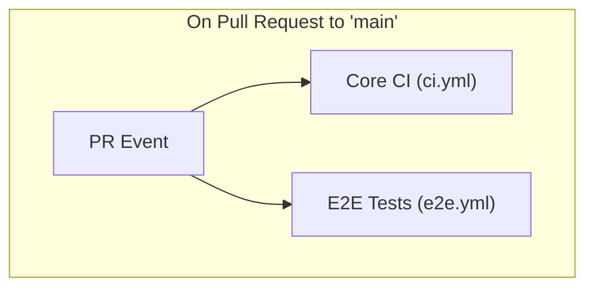
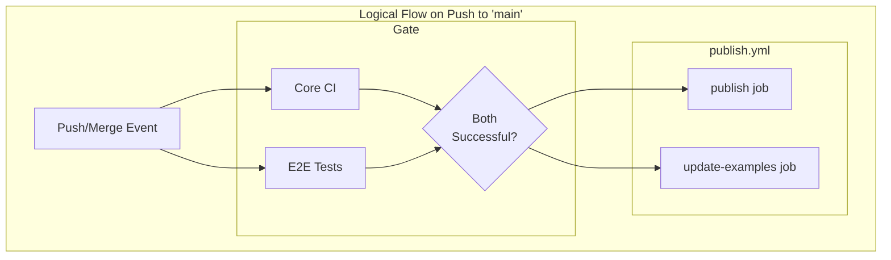

# GitHub Actions Workflow

This diagram illustrates the CI/CD pipeline for this project.

## On Pull Request to `main`

When a pull request is opened targeting the `main` branch, two workflows are triggered in parallel. Both must pass for the PR to be considered safe to merge.

## On Push to `main`

When a commit is pushed to `main` (e.g., after a PR is merged), a sequence is initiated where both `Core CI` and `E2E Tests` must complete successfully before any subsequent actions are taken.

1.  `Core CI` and `E2E Tests` run in parallel.
2.  If both are successful, the `Publish Package` workflow (`publish.yml`) is triggered.
3.  This workflow then runs two jobs in parallel: `publish` (which releases to NPM) and `update-examples` (which commits updated examples to the repository).

