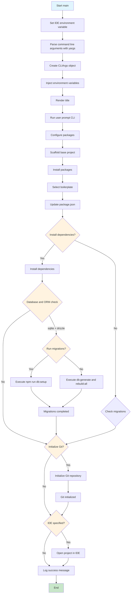

# Project Flow - create-electron-foundation

## Main Function Flow

## Key Components

- **CLI Parsing**: Uses yargs to handle command line arguments
- **User Interaction**: Interactive prompts for configuration
- **Package Management**: Dynamic package installation based on selections
- **Project Scaffolding**: Creates project structure and files
- **Conditional Operations**:
  - Dependency installation
  - Database migrations (SQLite + Drizzle)
  - Git initialization
  - IDE opening
- **Error Handling**: Try-catch blocks for external commands
