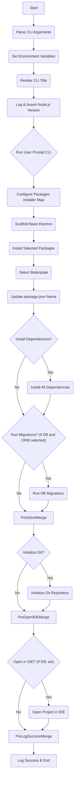

```mermaid
graph TD;
    A["Start"] --> ParseCLIArgs("Parse CLI Arguments");

    ParseCLIArgs --> SetEnvVars("Set Environment Variables");

    SetEnvVars --> RenderCLITitle("Render CLI Title");

    RenderCLITitle --> LogAndAssertNodeVersion("Log & Assert Node.js Version");

    LogAndAssertNodeVersion --> RunUserPrompts{"Run User Prompt CLI"};

    RunUserPrompts --> ConfigurePkgInstallerMap("Configure Packages Installer Map");

    ConfigurePkgInstallerMap --> ScaffoldElectronBase("Scaffold Base Electron");

    ScaffoldElectronBase --> InstallSelectedPkgs("Install Selected Packages");

    InstallSelectedPkgs --> SelectBoilerplate("Select Boilerplate");

    SelectBoilerplate --> UpdatePackageJsonName("Update package.json Name");

    UpdatePackageJsonName --> PromptInstallDependencies{"Install Dependencies?"};

    PromptInstallDependencies -- Yes --> InstallAllDependencies("Install All Dependencies");
    PromptInstallDependencies -- No --> PromptRunMigrations;

    InstallAllDependencies --> PromptRunMigrations{"Run Migrations? (if DB and ORM selected)"};

    PromptRunMigrations -- Yes --> RunDBMigrations("Run DB Migrations");
    PromptRunMigrations -- No --> PreGitInitMerge;

    RunDBMigrations --> PreGitInitMerge;

    PreGitInitMerge --> PromptInitializeGit{"Initialize Git?"};

    PromptInitializeGit -- Yes --> InitializeGitRepo("Initialize Git Repository");
    PromptInitializeGit -- No --> PreOpenIDEMerge;

    InitializeGitRepo --> PreOpenIDEMerge;

    PreOpenIDEMerge --> PromptOpenInIDE{"Open in IDE? (if IDE set)"};

    PromptOpenInIDE -- Yes --> OpenProjectInIDE("Open Project in IDE");
    PromptOpenInIDE -- No --> PreLogSuccessMerge;

    OpenProjectInIDE --> PreLogSuccessMerge;

    PreLogSuccessMerge --> LogSuccessAndEnd["Log Success & End"];
```
